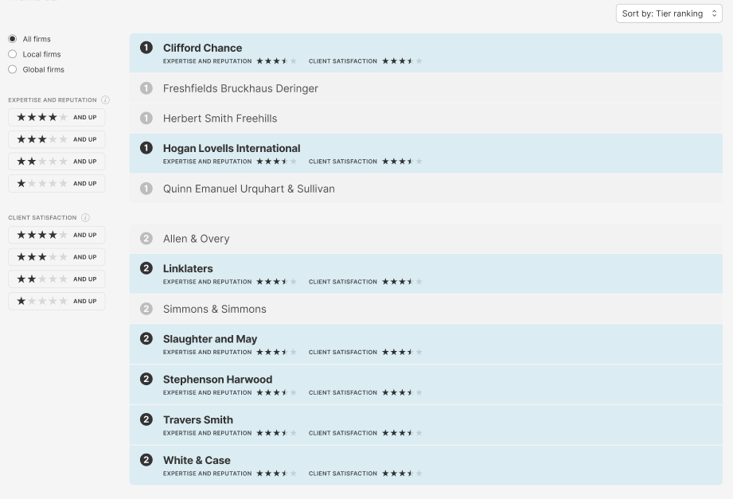

# React Tech Test - July 2023

## Setup

In the command-line:

- run `yarn` to install node_modules
- add `.env` to the root directory and add the neccessary variables. An example of which variables you need can be found in the `.env-example`
- run `yarn start` to load the application into the browser

## Tests

- run `yarn test` to run the tests

## Task

Copy image as much as possible within 4 hours.

## Notes / Improvements

- If I had more time I would have done more testing.
- I would have reviewed the Types in more detail.
- I would have liked to have had more time to add more functionality for example: "All firms", "Local firms" and "Global Firms". I would have also implemented sort by selector.
- Please note I have implemented the star filters on the left hand side.
- I would have one set of stars on the side and make it responsive so you can select between 1 - 5 rather than having 5 lists of stars.
- Because of the UI in the picture does not have half stars it's not possible to filter stars by 1.5 stars for example. Of course they are ways around this but not in given time frame.
- As there were no API docs I have to make some assumptions based on the response from the API; for example:
  - "Expertise and Reputation" and "Client Satisfaction", I assumed score is out of 1000.
  - "trends" and "tiers" are two examples of potential unions or enums. I do not have an exhaustive list of possible values.

## Tech Stack

- React
- TypeScript
- Redux
- Tailwind CSS
- CSS Grid & Flexbox

The above tech stack choice is pretty standard with perhaps the exception of Tailwind CSS. I have seen Tailwind CSS pop up more and more on job specifications so wanted the opporunity to familarise myself with the library
